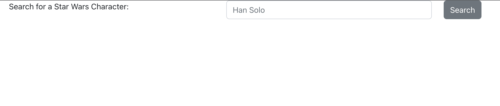
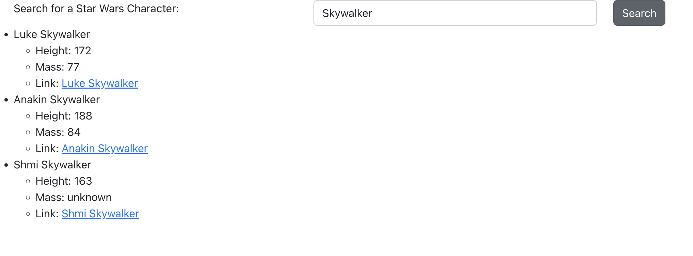

# Cypress for Beginners

[Cypress](https://www.cypress.io/) is an end-to-end testing framework built with Javascript. In addition to providing a framework for *writing test code,* it also provides an interactive UI through which to verify, capture, and create browser behavior.

## Getting Started

Before we add our first tests, let's take a look at our app. First, install all the packages by running:

```sh
npm install
```

OR

```sh
yarn
```

Next, start the app:

```
yarn start
```

OR

```sh
npm start
```

If you open a browser, and go to http://localhost:3000, we should see the following:



Type "Skywalker" into the input field, and click "Search". Now we should see search results:



## Setting Up Cypress