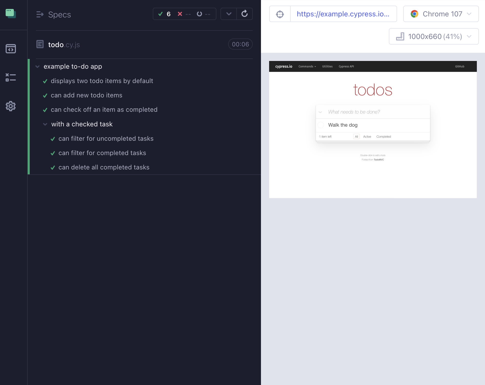
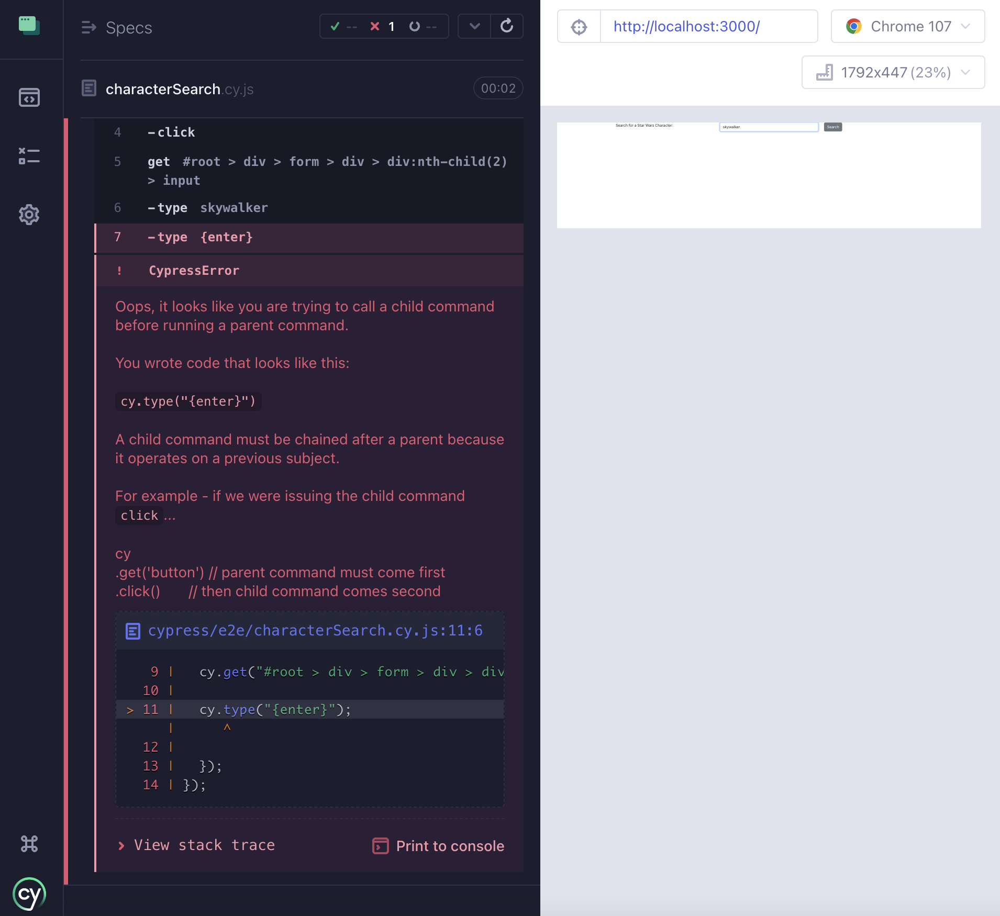

# Cypress for Beginners

[Cypress](https://www.cypress.io/) is an end-to-end testing framework built with Javascript. In addition to providing a framework for *writing test code,* it also provides an interactive UI through which to verify, capture, and create browser behavior.

## Getting Started

Before we add our first tests, let's take a look at our app. First, install all the packages by running:

```sh
npm install
```

OR

```sh
yarn
```

Next, start the app:

```
yarn start
```

OR

```sh
npm start
```

If we open a **Chrome** browser, and go to http://localhost:3000, we should see the following:


Type "Skywalker" into the input field, and click "Search". Now we should see search results:


## Setting Up Cypress

Rather than tying ourselves to a specific version of `cypress`, we can use `npx` to ensure we always use the latest version. Run the following command:

```sh
npx cypress open
```

This will show the following message: `It looks like this is your first time using Cypress`, and open a UI that looks similar to this (may vary slightly based on `cypress` version):


Select "E2E Testing".


Next, select "Continue" (again, UI options may vary for different versions):


Then select "Start E2E Testing...":

This will open a browser where we can click "Scaffold example specs":


Select `todo.cy.js` to see what a Cypress run looks like:




Then open `todo.cy.js` in your code editor to see what the tests look like.

These examples will serve as a useful resource, but for now, let's return to our Star Wars search app.

## Installing Cypress Recorder Extension

Open a new tab in Chrome, and install the [Cypress Recorder Extension](https://chrome.google.com/webstore/detail/cypress-recorder/glcapdcacdfkokcmicllhcjigeodacab?hl=en-US).

## Recording a User Flow for Cypress

Switch back to the http://localhost:3000 tab and refresh it.

Open Developer Tools, select "Recorder" then "Start a new recording":


- Click in the input box
- Type "skywalker"
- Hit the `return` key
- Click "End recording"
- Click the "Export" (down arrow) button
- Select "Export as a Cypress Test script"
- Save the file as `characterSearch.cy.js`
- Move this file into the `cypress/e2e` folder


Click `characterSearch.cy.js` at the bottom of the specs in the Cypress Browser window.

OK, so the recorder isn't perfect. If you see the error below:



then combine your `.type` commands like so:

`cy.get("#root > div > form > div > div:nth-child(2) > input").type("skywalker{enter}");`

Now, let's create an expectation. Click the crosshair button to open the profiler.

Select the list of results (the whole list, not just one result), and click the clipboard button to copy the selector.

Paste the selector into the `characterSearch.cy.js` file and save the file.

In `cypress`, we check expected values with the `.should` method. Add this expectation to our selector and save again:

`cy.get(".results").should("contain", "Luke Skywalker");`

We can also verify we receive the expected **length** of `results`:

`cy.get(".results .result").should("have.length", 3);`

We can also use jQuery-like iterators to verify each similar element has similar contents:

```js
cy.get(".results .result").each(($item) => {
    expect($item.text())
    .to.include("Height")
    .and.to.include("Mass")
    .and.to.include("Link");
    expect($item.find("a").attr("href")).to.include("https://swapi.dev/api/people/");
});
```

Save the file again, and make sure all our tests are still passing.

## Cypress Variables

Note that we're using `cy.get(".results .result")`. If we want to DRY out our code we can replace this with a variable for `result` as follows:

`cy.get(".results .result").as('result');`

Then update our duplicate selectors like so:

```js
cy.get("@result").should("have.length", 3);

cy.get("@result").each(($item) => {
    expect($item.text())
    .to.include("Height")
    .and.to.include("Mass")
    .and.to.include("Link");
    expect($item.find("a").attr("href")).to.include("https://swapi.dev/api/people/");
});
```

## Further Resources

Ready to learn about more Cypress features? Then check out these docs to take your skills to the next level!

- [Cypress Tasks](https://docs.cypress.io/api/commands/task): Execute node commands
- [Cypress Fixtures](https://docs.cypress.io/api/commands/fixture): Load a fixed set of mock data
- [Cypress Intercepts](https://docs.cypress.io/api/commands/intercept): Spy and stub network requests